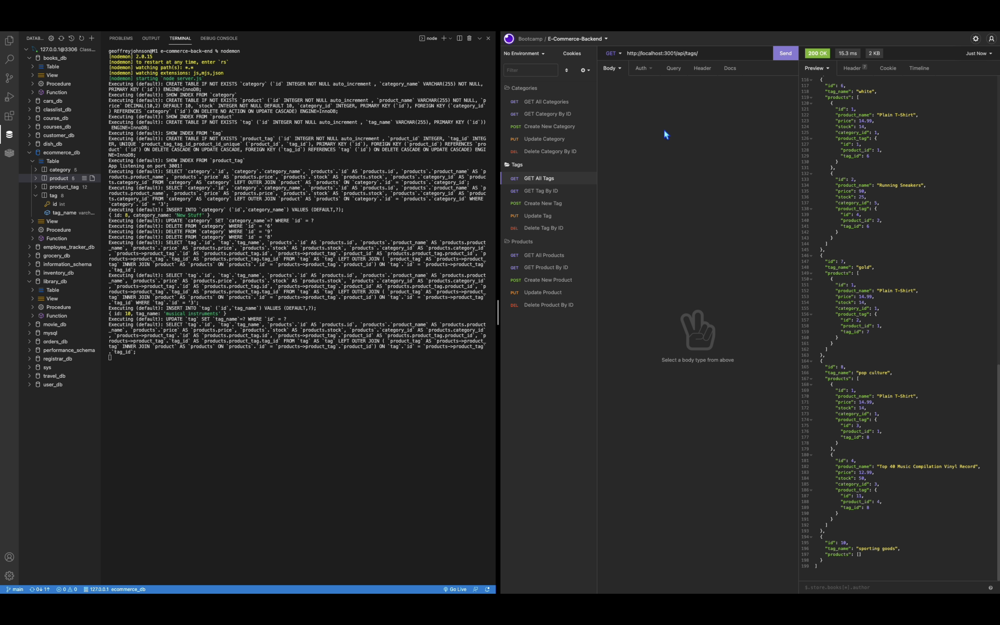

# E-Commerce Backend

## Table of Contents
* [Description](#description)
* [Database Schema](#database-schema)
* [Screenshots](#screenshot)
* [Installation](#installation)
* [Usage](#usage)
* [Link](#link)
* [Code](#code)
* [Contact](#contact)
* [Technologies](#technologies)
* [Project Status](#project-status)

## Description 
This is a back end for an e-commerce site that uses Express and Sequelize to interface with a MySQL database. The linked video walkthrough shows examples of RESTful CRUD operations being performed using Insomnia.

## Screenshots



## Database Schema
(ecommerce_db)

	• Category
	    ◦ id
	    ◦ category_name

	• Product
	    ◦ id
	    ◦ product_name
	    ◦ price
	    ◦ stock
		◦ category_id (References the `Category` model's `id`)

	•	Tag
	    ◦ id
	    ◦ tag_name

	•	ProductTag
	    ◦ id
	    ◦ product_id (References the `Product` model's `id`)
	    ◦ tag_id (References the `Tag` model's `id`)


## Installation
Install npm dependencies:
```bash
npm install
```
Load database schema:
```bash
mysql -u root
source db/schema.sql;
```

Optional - Load seed data:
```bash
npm run seed;
```


## Usage
The application can be invoked with the following command:
```bash
node index.js
```
Calls to the api can be made using Postman or Insomnia.


## Link
[Video Walkthrough](https://drive.google.com/drive/folders/1BQRRPhXHZzI-hGZ5gswIW9H_-gHgJeNy?usp=sharing)


## Code
[GitHub Code Repository](https://github.com/Johny49/e-commerce-back-end)


## Contact 
Created by [@johny49](https://github.com/Johny49/) - feel free to contact me!


## Technologies
- JavaScript
- Node.js
- Express
- MySQL
- Sequelize


## Project Status
Project is: completed and functioning as intended.  
Potential future improvements include:
* Creation of front end website or mobile app to access the back end data
